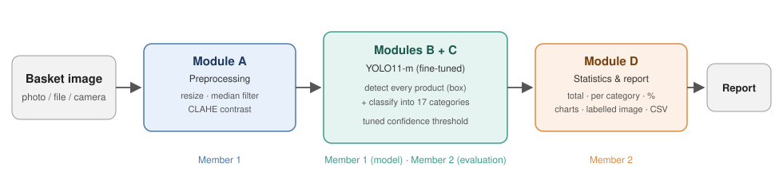

# Smart Supermarket Product Identification System

**EC9570 Digital Image Processing — University of Jaffna**

Identifies every product in a supermarket basket / checkout image, classifies it into one of
**17 product categories**, and reports the total count, count per category and percentage distribution.



| Module | What it does | Code |
|---|---|---|
| A | Image acquisition & preprocessing (resize, median-filter noise removal, CLAHE contrast enhancement) | `src/smartcheckout/preprocessing.py` |
| B + C | Product detection **and** 17-class classification in one pass of a fine-tuned **YOLO11-m** | `src/smartcheckout/detection.py`, `training.py` |
| D | Statistics & report: counts, %, bar + pie chart, labelled image, CSV | `src/smartcheckout/reporting/report.py` |

## Dataset and classes

[RPC — Retail Product Checkout dataset](https://www.kaggle.com/datasets/diyer22/retail-product-checkout-dataset)
(200 products / SKUs). The **17 classes are the dataset's own meta-categories** (`supercategory` field) —
nothing is categorised by hand: puffed food, dried fruit, dried food, instant drink, instant noodles, dessert,
drink, alcohol, milk, canned food, chocolate, gum, candy, seasoner, personal hygiene, tissue, stationery.

| Split | Images | Used for |
|---|---|---|
| val2019 — 90 % | ~5,400 checkout scenes | training |
| val2019 — 10 % | ~600 | hold-out: validation + confidence-threshold tuning |
| test2019 | 24,000 | **final test only** |
| val2019 — 5 folds | 6,000 | cross-validation (stability of the results) |

Splits are made by image and stratified by difficulty (easy / medium / hard).
`train2019` (single-product turntable photos) is not used: they look very different from checkout scenes.

## Evaluation

* **mAP50 / mAP50-95** per class (detection quality)
* **Classification accuracy** — correctly located products with the right category (**target ≥ 80 %**)
* **Product-level accuracy**, detection precision / recall, per-class precision / recall / F1
* **Count accuracy** and **checkout accuracy (cAcc)** — exact number of products / exact shopping list per image
* **ACD** — average counting distance; everything also per difficulty level
* **5-fold cross-validation** — mean ± std and 95 % confidence interval of every metric

## Repository layout

```
smart-supermarket-checkout/
├── configs/
│   ├── config.yaml              all settings (Kaggle defaults)
│   └── local_cpu.yaml           tiny settings for a laptop test run
├── src/smartcheckout/
│   ├── config.py                settings + shared paths                    [Member 1]
│   ├── data/
│   │   ├── dataset.py           dataset loading, 17-class definition       [Member 1]
│   │   ├── splits.py            hold-out / test / K-fold splits            [Member 1]
│   │   └── yolo_format.py       YOLO labels and data files                 [Member 1]
│   ├── preprocessing.py         Module A                                   [Member 1]
│   ├── detection.py             Modules B + C inference pipeline           [Member 1]
│   ├── training.py              final model + CV fold training             [Member 1]
│   ├── evaluation/
│   │   ├── metrics.py           matching, accuracy, cAcc, ACD, per class   [Member 2]
│   │   ├── validation.py        hold-out validation, threshold tuning      [Member 2]
│   │   ├── test_eval.py         final test on test2019                     [Member 2]
│   │   └── cross_validation.py  K-fold cross-validation                    [Member 2]
│   ├── reporting/
│   │   ├── report.py            Module D (per-image report)                [Member 2]
│   │   ├── figures.py           all plots                                  [Member 2]
│   │   └── outcomes.py          outcomes package (md, json, xlsx, csv)     [Member 2]
│   └── export.py                export for local CPU use                   [Member 2]
├── scripts/                     one script per phase (+ run_all.py)
├── notebooks/kaggle_runner.ipynb  runs the scripts on a Kaggle GPU
├── tests/                       unit tests (run automatically by GitHub Actions)
├── demo.py                      local demo on your own images             [Member 2]
└── WORK_DIVISION.md             who does what, branches, pull requests
```

## 1. Train on Kaggle

1. Push this repository to GitHub.
2. Create a Kaggle notebook from `notebooks/kaggle_runner.ipynb`, add the dataset input, enable **GPU** and **Internet**.
3. Set `REPO_URL`, then *Save Version → Save & Run All*.
   Session plan (each step skips finished work):

| Session | Settings |
|---|---|
| 1 | `run_cv=false` → prepare, train, validate, test, outcomes, export (~5–7 h on a T4) |
| 2 | `resume_from=<session 1 output>`, `cv_folds_to_run=[0,1,2]` |
| 3 | `resume_from=<session 2 output>`, `cv_folds_to_run=[3,4]` → final outcomes + export |

Or run the scripts directly (any machine with the dataset):

```bash
pip install -r requirements.txt
python scripts/run_all.py --config configs/config.yaml                 # everything
python scripts/train.py --set epochs=10 batch=4                        # one phase, with overrides
python scripts/cross_validate.py --set "cv_folds_to_run=[0,1]"         # part of the CV
```

Outputs (in `work_dir`): `rpc17_outcomes.zip` (all results for the report) and `rpc17_export.zip` (the model).

## 2. Run the demo locally (CPU)

```bash
pip install -r requirements.txt
unzip rpc17_export.zip -d export
python demo.py --images samples/                # a folder or single images
python demo.py --images basket.jpg --conf 0.5 --denoise --clahe --out results
```

For every image: `*_annotated.jpg` (boxes + category labels), `*_summary.csv` (count and % per category),
`*_chart.png` (bar + pie chart), `*_detections.json`, and a printed summary:

```
========================================================
                 basket.jpg  (0.84 s)
========================================================
Total products detected : 9
Categories present      : 3
--------------------------------------------------------
Category                       Count       Percent
drink                              4         44.4%
candy                              3         33.3%
puffed_food                        2         22.2%
========================================================
```

## 3. Tests

```bash
pip install -r requirements-dev.txt
pytest -q
```

## Results

After training, copy the key numbers from `outcomes/outcomes_report.md` here:

| Metric | Hold-out | test2019 | 5-fold CV (mean ± std) |
|---|---|---|---|
| mAP50 | | | |
| Classification accuracy | | | |
| Checkout accuracy (cAcc) | | | |

## Team

| Member | Responsibility |
|---|---|
| Member 1 — *name* | Data preparation, Module A (preprocessing), Modules B + C (YOLO model, training) |
| Member 2 — *name* | Evaluation (validation, test, cross-validation), Module D (report), outcomes, export, demo |

See [WORK_DIVISION.md](WORK_DIVISION.md).
